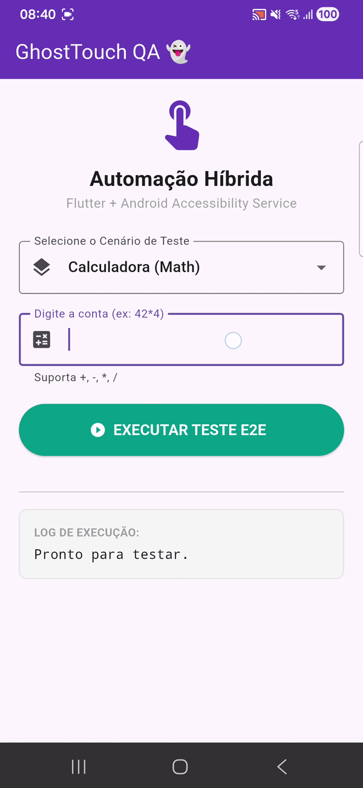

# GhostTouch QA 👻
   

> **GhostTouch QA** é uma Prova de Conceito (PoC) de um Driver de Automação Mobile "Black-box", desenvolvido para demonstrar como frameworks como Appium ou Maestro interagem com o Sistema Operacional em baixo nível.

Este projeto implementa um **Native Bridge** que permite ao Flutter controlar o Android Accessibility Service, possibilitando a execução de testes End-to-End (E2E) em aplicativos de terceiros sem acesso ao código-fonte ou instrumentação (APK debugging).

---

## 📱 Case de Sucesso: Automação da Calculadora Android

Para validar a robustez do driver, implementei um cenário de teste E2E complexo que interage com a Calculadora nativa do Android. O fluxo testa não apenas a interação (cliques), mas também a validação de dados (extração de texto) e navegação entre apps (multitasking).


*(GIF de demonstração da automação rodando)*

### 🔄 Fluxo Automatizado
1.  **Input no App de Teste**: O usuário digita uma operação (ex: `15 * 3`) no app Flutter.
2.  **Context Switching**: O driver envia o comando `GLOBAL_ACTION_HOME` e navega até a Calculadora.
3.  **Black-box Interaction**:
    *   Identifica os botões visualmente (pelo texto "1", "5", "×", "3").
    *   Trata diferenças de plataforma (converte `*` para `×` e `-` para `−`).
4.  **Validação (Assertion)**: Clica em `=` e faz um **Screen Scraping** da tela para ler o resultado.
5.  **Round-trip**: Utiliza o menu `RECENTS` para retornar ao app GhostTouch QA e exibir o resultado extraído para asserção.

---

## 🛠️ Destaques Técnicos (Under the Hood)

### 1. Arquitetura Híbrida (Flutter + Native Kotlin)
A comunicação entre a camada de teste (Dart) e o driver (Kotlin) é feita via **MethodChannels** bidirecionais, garantindo baixa latência na execução de comandos (IPC).

### 2. Smart Locator & Exact Match Logic
Um dos maiores desafios de usar `AccessibilityService` para automação é a desambiguidade. Um simples `findAccessibilityNodeInfosByText("2")` retornaria tanto o botão "2" quanto o visor exibindo "25".

Implementei uma lógica de filtragem que prioriza "Nós Clicáveis" e "Match Exato" antes de flexibilizar a busca:

```kotlin
// Snippet simplificado da lógica de Locator no Kotlin
fun clickByText(text: String): Boolean {
    // 1. Busca todos os nós que contêm o texto
    val list = rootNode.findAccessibilityNodeInfosByText(text)
    
    // 2. Filtra pelo match exato E clicável (evita falsos positivos em labels)
    val exactMatch = list.firstOrNull { node ->
        node.isClickable && node.text.toString().equals(text, ignoreCase = true)
    }

    // 3. Injeta o gesto no centro do elemento encontrado
    val target = exactMatch ?: list.firstOrNull { it.isClickable }
    if (target != null) {
        val rect = Rect()
        target.getBoundsInScreen(rect)
        // Dispara o evento de toque no hardware (X, Y)
        dispatchGesture(createTapPath(rect.centerX(), rect.centerY()), null, null)
        return true
    }
    return false
}
```

### 3. Screen Scraping (OCR-like)
Para validação de testes (Assertions), o driver lê recursivamente toda a árvore de nós (`AccessibilityNodeInfo`) da janela ativa, extraindo textos de `TextViews`, `Buttons` e `EditTexts`. Isso permite validar o estado da tela sem depender de IDs fixos, crucial para testes *Black-box* em apps de terceiros.

---

## 🚀 Funcionalidades do Driver

*   **📍 UI Location Strategy**: Busca dinâmica de elementos por texto visível (Testes resilientes a mudanças de layout).
*   **👆 Gesture Injection**: Simulação de toques humanos via `dispatchGesture` API (não é clique sintético de View).
*   **🔄 Global System Actions**: Controle total de hardware (Home, Back, Recents, Notifications).
*   **🛡️ Flaky Tests Prevention**: Mecanismos de `retry` e `wait` implícitos no lado do cliente (Flutter) para lidar com animações do sistema.

---

## 💻 Como Executar

> [!IMPORTANT]
> Este projeto depende de permissões elevadas de Acessibilidade para injetar eventos de toque.

1.  **Clone o repositório**:
    ```bash
    git clone https://github.com/seu-usuario/ghost-touch-qa.git
    ```
2.  **Execute o App**:
    ```bash
    flutter run
    ```
3.  **Permissão Crítica**:
    *   Ao abrir, o app solicitará ativação do serviço.
    *   Vá em **Configurações > Acessibilidade > GhostTouch QA** e ative o serviço.
    *   *Sem isso, o IPC retornará erro `SERVICE_OFF`.*

---

## 🔮 Próximos Passos (Roadmap)

*   [ ] Implementar **Record & Replay**: Gravar as ações do usuário e gerar o script de teste automaticamente.
*   [ ] Suporte a **Gestos Complexos**: Implementar Swipe/Scroll para lidar com ListViews infinitas (Scroll to find).
*   [ ] Integração com CI/CD para rodar em emuladores headless.

---

*Projeto desenvolvido com foco em Engenharia de Qualidade e Arquitetura de Automação.*
